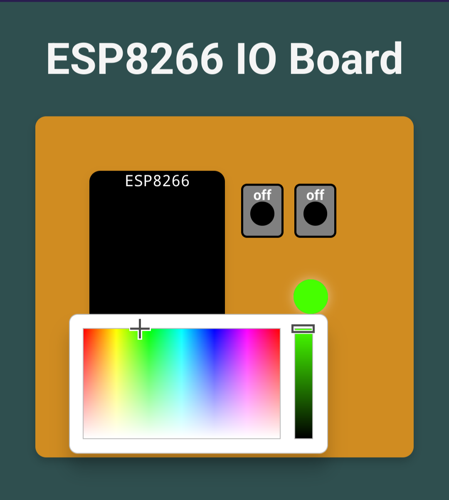

# ESP8266 I/O Board Websocket Example

En este proyecto se expone un ejemplo de código con ESP8266 (módulo NodeMCU) en el cual se utiliza un Servidor Web Asincrónico y un WebSocket para servir una página web en formato comprimido (gzip) utilizando LittleFS.

<p style="text-align: center;"></p>


Se puede mejorar mucho, pero intenté no utilizar conceptos de POO y dejar todo en un solo archivo para poder explorar y entender la secuencia de lo que ocurre. Por eso también dejé todo en un solo archivo, para tener todo en un solo lugar, no es lo mejor, pero tampoco quería complejizar de más el ejemplo, porque es eso, un ejemplo no software productivo. 

> [!IMPORTANT]
> Este proyecto está desarrollado sobre GNU/Linux (Debian) y PlatformIO, si quiere utilizar otro set de herramientas debe hacer ajustes que aquí no serán explicados más allá de lo que está expuesto bajo ningún concepto. *You're on your own*.

## Carga del programa y la página web en el filesystem

### Dependencias

Los scripts de compilado y deploy del proyecto necesitan las siguientes dependencias:

* gzip
* python3-rjsmin
* python3-csscompressor
* python3-htmlmin

Los puede instalar ejecutando:

```bash
sudo apt install gzip python3-rjsmin python3-csscompressor python3-htmlmin -y
```

### Carga en el ESP8266

Si utiliza PlatfomIO sobre linux instalado en la carpeta por default ("~/.platformio/") y tiene las dependencias necesarias, puede ejecutar:

```bash
./upload.sh
```

Esto generará la carpeta "data/" tomando los datos presentes en la carpeta "html/", minificandolos y comprimiéndolos en gzip y luego compilará y grabará el firmware en el ESP8266, por último generará la imágen del filesystem y la grabará en el ESP8266.


En caso de no utilizar PlatformIO, para generar la carpeta "data/" que es la que se sube al filesystem, puede solo ejecutar el script:

```bash
./populate_data.sh
```

Esto generará la carpeta "data/" con los datos tomados de "html/" minificados y comprimidos con gzip.

## Funcionamiento

Una vez grabado el firmware y la imagen del filesystem, podrá acceder al WiFi en modo AP (*Access Point*) a la red llamada `ESP8266 IO Board` con la contraseña `asdf1234`. Una vez conectado debe dirigirse a su navegador e ingresar la IP `192.168.4.1` para acceder al servidor web. Eso le cargará una página donde se ve dibujada la placa con los pulsadores, el LED RGB, el LDR y dispositivos I²C presentes en la misma.

> [!NOTE]  
> Los dispositivos I²C soportados hasta el momento son `display LCD` de 16x2 a base de caracteres (con expander I²C) y los sensores `AHT10` (Temperatura y humedad) y `BH1750` (luxómetro).

<p style="text-align: center;"></p>

A través del `WebSocket` se irá refrescando cada 50ms la información del estado de la placa, y a su vez, cada vez que interactúe con la misma, se verán los cambios en el hardware. Es decir, que si toca el botón en la interfaz web, esto se verá reflejado en el soporte físico. Al igual que si se presiona el botón físico, se verá reflejado en la interfaz web.
